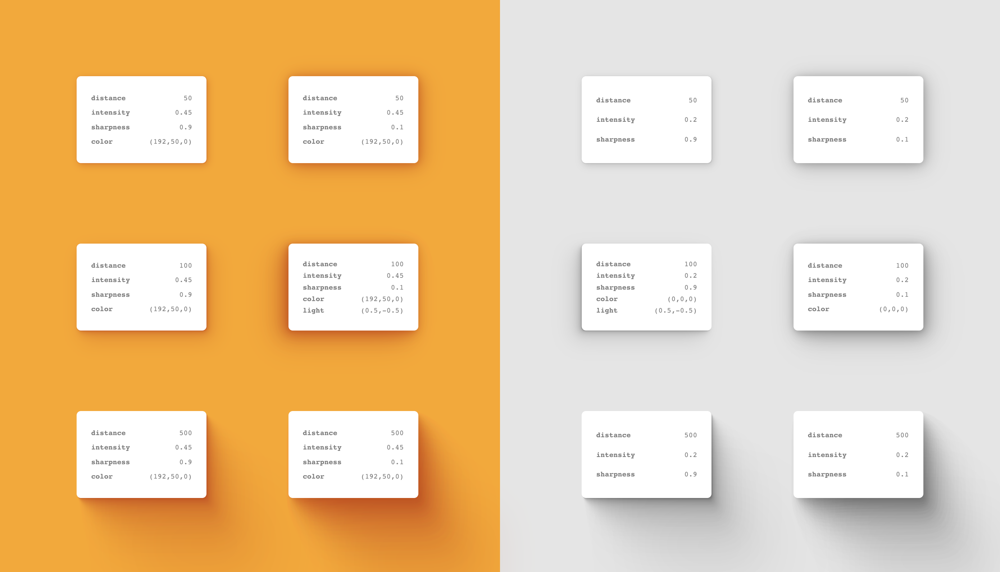

# parse-font-name

> Generate smooth, consistent and always-sexy box-shadows, no matter the size, ideal for design token generation.



[Demo](http://tom2strobl.github.io/smooth-shadow)

As [Tobias](https://tobiasahlin.com/blog/layered-smooth-box-shadows/) already pointed out in 2019, a regular singular CSS `box-shadow` statement is as dull as it gets. Which is fine as long as you use it as a low-level API. And that's what we do by layering multiple box-shadows in a way to make them look a lot more physically realistic. No, the shadows are not *really* raytraced, but we borrow some concepts.

Many great people tackled the issue from Tobias Sahlin, to Philipp Brumm and Josh W Comeau, but none of them offered their solution as OSS-code. The previous attempts at libraries of other folks give you lots of settings like direct alpha, blur and spread settings, but on the flipside that means and you have to find good values for small and large shadows yourself.

`smooth-shadow` is largely opinionated in what makes a great smooth shadow and only offers you relevant options for your usecase:
a) Distance (basically the elevation/size of the shadow)
b) Intensity (which should vary depending on environment color)
c) Sharpness (which - although largely opinionated - leaves a little room for the projects style)
d) Color (as real cast shadows pick up the color of reflected light from the surface they are cast on)

- *zero* dependencies
- *fully typed* in typescript
- *small* footprint (2.3kb minified)
- CommonJS bundle, .mjs bundle, .d.ts bundle + type-checking & Source maps

## Installation

`npm i smooth-shadow` or `yarn add smooth-shadow`

## Usage

```typescript
import { getSmoothShadow } from 'smooth-shadow'

// it returns a box-shadow css statement ready to use
const boxShadow = getSmoothShadow(100, 0.5, 0.5)

// eg. on a jsx component
<div style={{ boxShadow }} />

// or eg. in a styled component
styled.div`box-shadow: ${boxShadow}`

// or eg. even better in a styled-component (or any other framework) theme
const cardShadow = getSmoothShadow(100, 0.5, 0.5)
const theme = { cardShadow }
<ThemeProvider theme={theme} />
styled.div`box-shadow: ${({ theme }) => theme.cardShadow};`

// or eg. even better better as a shadow factory
const appShadow = (distance: number) => getSmoothShadow(distance, 0.5, 0.5)
const cardShadowSmall = appShadow(50)
const cardShadowBig = appShadow(200)
const theme = { cardShadowSmall, cardShadowBig }
<ThemeProvider theme={theme} />
const SmallCard = styled.div`box-shadow: ${({ theme }) => theme.cardShadowSmall};`
const BigCard = styled.div`box-shadow: ${({ theme }) => theme.cardShadowBig};`
```

```typescript
getSmoothShadow((
  // the distance the shadow travels, larger distance = larger shadow
  distance?: number, // default 100 (between 0 & 1000)
  // sort of your "opacity" parameter if you will
  intensity?: number, // default 0.5 (between 0 & 1)
  // low values result in a more mellow shadow, high values in a more crispy experience
  sharpness?: number, // default 0.5 (between 0 & 1)
  // on colored backgrounds you should tint your shadows for more sexiness, totally optional though
  rgb?: [number, number, number] // default [0, 0, 0]
) => string
```

For the code example of the screenshot / the [Demo](http://tom2strobl.github.io/smooth-shadow), check out `/docs/index.js`.

## How it works

Depending on `distance` a good amount of layers is determined and then through carefully self-crafted bezier-easing-functions in combination with the `sharpness` and `intensity` arguments realistic looking results are plotted.

## Performance

With `179 818 ops/s, ±1.92%` it's considerably fast. That being said I would not suggest you to try animate generated shadow-values directly as there can be up to 24 layers of shadows and animating them directly is costly. Instead animate the opacity of an element that has said shadow. [Read more](https://tobiasahlin.com/blog/how-to-animate-box-shadow/)
